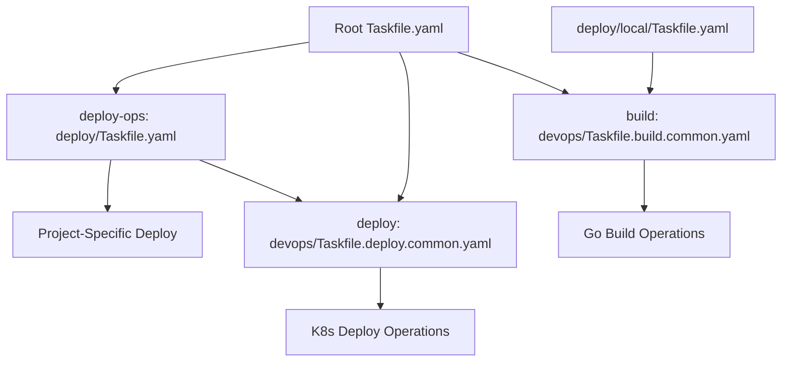

# DevOps Task Architecture

This document describes the new modular DevOps task architecture for the Semantic Cache project.

## Directory Structure

```
semantic-cache/
├── Taskfile.yaml                           # Root orchestration
├── devops/                                 # ✨ DevOps task definitions
│   ├── Taskfile.build.common.yaml         # ✨ Go build, test, CI tasks
│   ├── Taskfile.deploy.common.yaml        # ✨ K8s deployment tasks
│   ├── Taskfile.example.yaml              # Usage examples
│   ├── README.md                          # DevOps documentation
│   ├── STRUCTURE.md                       # Structure documentation
│   └── ARCHITECTURE.md                    # This file
└── deploy/
    ├── Taskfile.yaml                      # 🔄 Updated: Uses deploy commons
    └── local/
        └── Taskfile.yaml                  # 🔄 Updated: Uses build commons
```

## Task Namespace Organization

### Build Namespace (`build:`)
**Source**: `devops/Taskfile.build.common.yaml`

```
build:build              # Build binary
build:build:all          # Multi-platform build
build:test               # Run tests
build:test:coverage      # Test with coverage
build:fmt                # Format code
build:lint               # Run linting
build:clean              # Clean artifacts
build:deps               # Manage dependencies
build:docker:build       # Build Docker images
build:ci                 # CI pipeline
build:release            # Create releases
```

### Deploy Namespace (`deploy:`)
**Source**: `devops/Taskfile.deploy.common.yaml`

```
deploy:full              # Complete workflow
deploy:quick             # Quick workflow
deploy:setup             # Setup cluster
deploy:deploy            # Deploy application
deploy:test:api          # API tests
deploy:test:benchmark    # Performance tests
deploy:status            # Check status
deploy:logs              # View logs
deploy:health            # Health checks
deploy:scale:up          # Scale up
deploy:debug             # Debug issues
deploy:cleanup           # Resource cleanup
```

## Task Flow Architecture



## File Responsibilities

### `devops/Taskfile.build.common.yaml`
- **Pure Go operations**: build, test, format, lint
- **Platform agnostic**: works on any Go project
- **No project-specific logic**
- **Configurable via variables**

### `devops/Taskfile.deploy.common.yaml`
- **Pure Kubernetes operations**: deploy, scale, debug
- **Generic cluster management**
- **No project-specific workflows**
- **Configurable via variables**

### Root `Taskfile.yaml`
- **Orchestration layer**: combines build + deploy
- **Project-specific customization**
- **User-friendly command interface**
- **Variable configuration**

### `deploy/Taskfile.yaml`
- **Project-specific deployment workflows**
- **Uses deploy commons + custom scripts**
- **Workflow orchestration**
- **Environment-specific logic**

### `deploy/local/Taskfile.yaml`
- **Local tool specific tasks**
- **Uses build commons for Go operations**
- **Tool-specific customizations**

## Migration Path

### Phase 1: ✅ COMPLETED
- [x] Create `devops/` directory structure
- [x] Extract build tasks to `Taskfile.build.common.yaml`
- [x] Extract deploy tasks to `Taskfile.deploy.common.yaml`
- [x] Update all Taskfile includes
- [x] Update all task references
- [x] Remove legacy `Taskfile.common.yaml`
- [x] Update documentation

### Phase 2: FUTURE
- [ ] Add more specialized task categories
- [ ] Create project templates
- [ ] Add task validation
- [ ] Create task generators

## Variable Configuration

### Global Variables (Root Taskfile)
```yaml
vars:
  DEPLOY_DIR: ./deploy
  DEVOPS_DIR: ./devops
```

### Build Variables
```yaml
vars:
  BINARY_NAME: semantic-cache
  BINARY_DIR: bin
  MAIN: ./cmd/server
  LDFLAGS: -X main.version={{.VERSION}}
```

### Deploy Variables
```yaml
vars:
  CLUSTER_NAME: sematic-cache
  API_URL: http://localhost:8080/semantic-cache
  APP_NAMESPACE: app
  WORKFLOW_SCRIPT: ./workflow.sh
```

## Key Benefits

1. **Clear Separation**: Build and Deploy concerns separated
2. **Reusability**: Common tasks work across projects
3. **Modularity**: Include only what you need
4. **Consistency**: Standardized commands everywhere
5. **Maintainability**: Update commons in one place
6. **Flexibility**: Override any behavior via variables

## Usage Patterns

### Development Workflow
```bash
task build           # Build application
task test            # Run tests
task deploy:setup    # Setup cluster
task deploy:deploy   # Deploy app
task deploy:health   # Check health
```

### CI/CD Workflow
```bash
task build:ci        # Run CI pipeline
task deploy:full     # Complete deployment
task deploy:test     # Run tests
task deploy:verify   # Verify deployment
```

### Debug Workflow
```bash
task deploy:status   # Check status
task deploy:logs     # View logs
task deploy:debug    # Debug issues
task deploy:restart  # Restart services
```

## Extension Points

### Adding New Build Tasks
1. Edit `devops/Taskfile.build.common.yaml`
2. Use `build:` prefix
3. Focus on language-agnostic operations

### Adding New Deploy Tasks  
1. Edit `devops/Taskfile.deploy.common.yaml`
2. Use `deploy:` prefix
3. Focus on infrastructure operations

### Adding Project-Specific Tasks
1. Edit local Taskfile
2. No prefix required
3. Delegate to commons when possible

This architecture provides a scalable, maintainable foundation for DevOps operations across all projects.